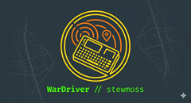

# Cardputer Wardriver

Turn your [M5Stack Cardputer](https://shop.m5stack.com/products/m5stack-cardputer-kit-w-m5stamps3) into a portable WiFi mapping tool. This firmware scans for 2.4 GHz networks, tags each one with GPS coordinates, and saves [WiGLE-compatible](https://wigle.net) CSV files to an SD card — ready to upload and contribute to the global wireless database.

## Highlights

- **Cardputer ADV support** — auto-detects and selects the default GPS pinouts for both Cardputer v1.1 and ADV models
- **Active & passive scanning** — per-channel hop or all-channel sweep with configurable dwell times
- **Three GPS logging modes** — strict fix-only, zero-GPS (log without coordinates), or last-known (reuse stale position)
- **Six live dashboards** — summary, security snapshot, live AP feed, new AP discovery, channel activity map, and system info — all flicker-free
- **Channel congestion map** — colour-coded bar chart with three views (session, sweep, unique) so you can spot crowded channels at a glance
- **Built-in WiFi web config portal** — configure everything from your phone's browser over the built-in WiFi hotspot
- **FLAG marker** — press the G0 button to drop a GPS-tagged marker in your CSV for points of interest
- **Privacy controls** — SSID/BSSID exclusion lists, up to 10 GPS geofence zones, MAC randomisation with OUI spoofing
- **Configurable sound alerts** — beep on new AP, blocked SSID, or geofence entry — each independently toggleable
- **Smart power management** — display blanking, scan stop/start, low-battery auto-shutdown with session summary
- **WiFi TX power & country code** — tune radio output and channel availability for your region
- **WiGLE CSV v1.6** output — upload directly to wigle.net, no conversion needed
- **On-device help** — press `H` anytime for a keyboard shortcut reference

## Quick Start

1. **Flash** the firmware via USB — `pio run --target upload`
2. **Wire a GPS module** to GPIO 1 (TX) and GPIO 2 (RX)
3. **Insert** a FAT32 micro SD card
4. **Power on** — first boot enters Config Mode automatically
5. **Connect** your phone/laptop to the `M5-Wardriver` WiFi network
6. **Configure** at `http://192.168.4.1`, then save and reboot. (default username: `admin`, default password: `password`) **Change the default password on first setup** — see [Configuration](docs/configuration.md).
7. **Go outside** — scanning starts automatically after GPS lock
8. **Safe Shutdown** — press `Q` to flush logs and unmount the SD card before powering off. Shows a session summary.

> **New here?** See the [Getting Started](docs/getting-started.md) guide for a full walkthrough with wiring diagrams and screenshots.

## What You Need

| Item | Notes |
|------|-------|
| M5Stack Cardputer v1.1 | ESP32-S3 based |
| GPS module (UART) | e.g., BN-220, NEO-6M, M5Stack GPS Unit |
| Micro SD card | FAT32, Class 10 recommended |
| USB-C cable | For flashing and serial debug |


## Build

Requires [PlatformIO](https://platformio.org/).

```bash
pio run                    # Build
pio run --target upload    # Build and flash
pio device monitor         # Serial monitor (115200 baud)
```

## Documentation

| Guide | What's inside |
|-------|---------------|
| [Overview & Architecture](docs/index.md) | How the firmware works, feature list, system design |
| [Getting Started](docs/getting-started.md) | Hardware setup, flashing, first boot walkthrough |
| [Configuration](docs/configuration.md) | Every setting explained with defaults and examples |
| [Web Interface](docs/web-interface.md) | Config portal layout, fields, and workflow |
| [Operation](docs/operation.md) | Dashboard views, keyboard controls, LED/buzzer behaviour |
| [LED Indicator](docs/led-indicator.md) | Status LED colour reference |
| [Troubleshooting](docs/troubleshooting.md) | Common problems and fixes |

## License

Released under the MIT License. See [LICENSE](LICENSE).
